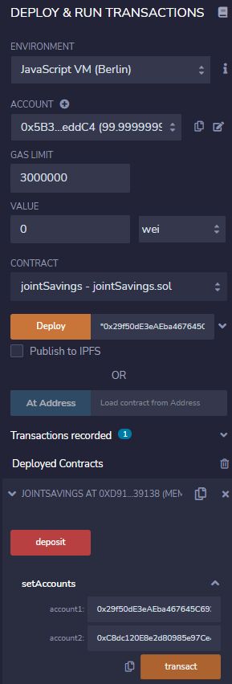
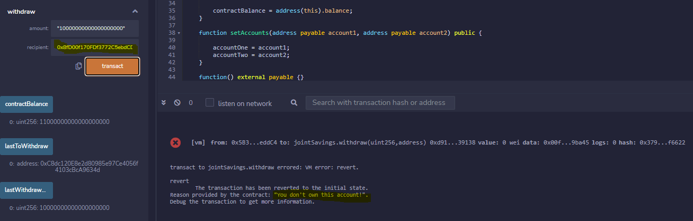

# hw_m20_joint_savings

This main file in this repo, joint_savings.sol, is a Solitidy smart contract that automates the creation of joint savings accounts. It accepts two user addresses that are able to control the account by making deposits and withdrawals.

Here is the deployed contract:

The following are examples of the functionality of the contract:

 - Set accounts

 - Deposits

 - Withdrawals

 - Error
 

